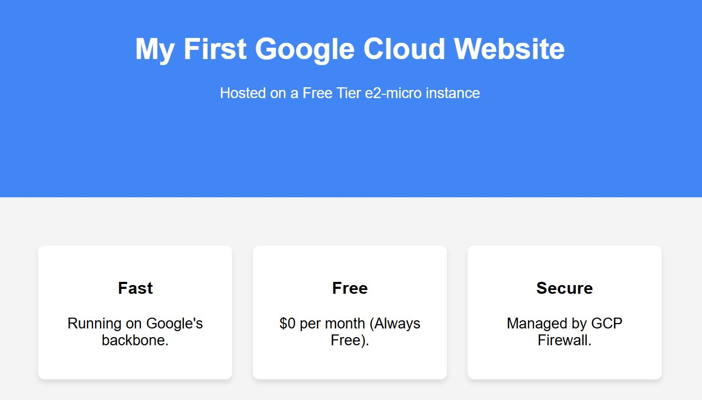
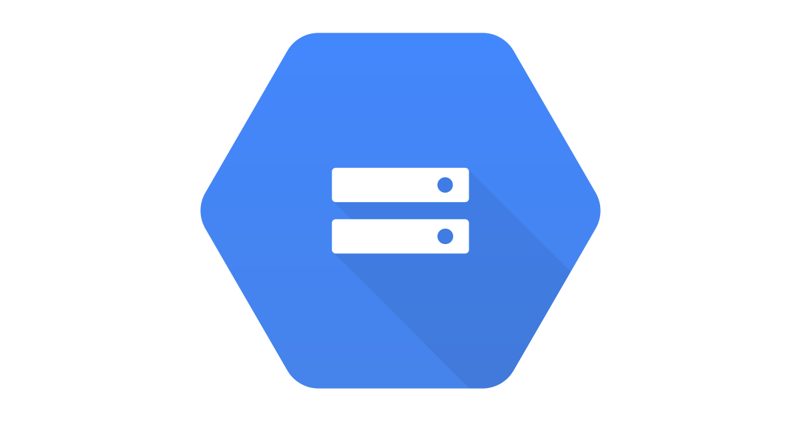

# **Cloud Computing**
Cloud computing is a on demand delivery of IT resources over the internet with pay-as-you-go pricing.
Instead of buying, owning and maintaining physical data centers and servers, you can access these resources from the cloud provider.
For example - 
Microsoft's Azure is suitable for it's enviorment for it's own windows or other platform by Microsoft.
Cloud Computing includes -->
- Networking
- Software Applications
- Security
- Data Storage
- Business Intelligence

# **Why do we need it?**
------------
1. Security - Different access settings for users. Encryption and data safey options provided by cloud providers.
2. Disaster Recovery - Quick data recovery and failover procedures for all emergency scenarios.
3. Cost Saving - Pay as you go, Only pay for what you use. No need for large sums of capital to start using cloud computing.
4. Flexibility - More flexible than a local environment. Can scale up or down as needed.
for example -
let's say we have a two clients, one's project is on localhost including database and all. And second client's data and all other
stuff is on cloud. So, second client can access his data and all other stuff from cloud. And if anything happens to first client's 
device like laptop whole system will shutdown. But second client's data and all other stuff will be safe on cloud.

------------

# **GCP or Google Cloud Platform**
GCP is a range of cloud computing services that is offered by Google.
It includes - 
- Compute Engine
- App Engine
- Cloud Storage
- BigQuery
- Cloud SQL
- Cloud Pub/Sub
- Cloud Functions
- Cloud Run
- Cloud Spanner
- Cloud Datastore
- Cloud Memorystore

------------

## **Why GCP uses more?**
- Google's own platform such as youtube, and gmail utilies GCP to be at the top of the market.
GCP was started in 2011 and it's services are used by many companies such as - 
- Netflix
- Spotify
- Uber
- Airbnb
- Dropbox
- After AWS , GCP is in the leader list and is booming nowadays.
- GCP Offers 
  * 35 Regions
  * 106 Zones (one zone is a single data center)
  * Approx 180 Network Edge Locations which is a point of presence for GCP services.
  * Available in more than 200+ Countries and Regions.

------------

## **What GCP Offers in Free Tier?**
- Compute engine
- Cloud storage 5gb only
- Bigquery 1tb per month only
- Google Kubernetes Engine 1 node per month only
- App Engine 1 instance per month only
- Cloud Run 1 instance per month only
- Cloud Build 10000 build minutes per month only
- Operations 1 instance per month only, formerly called as Stackdriver Operations.


## **GCP provides various range of services, in which compute engine is mostly used and then storage services**

------------

# **GCP Cheatsheet**


------------

# **GCP Compute Services**
Compute service are used for computing, To put it simply any kind of processing comes under compute services.
It mainly conists of CPUS and RAM like a physical layer. GCP offers a range of compute services like VRAM, GPUs, TPUs, etc.
- **Virtual Machines** - GCP offers a range of virtual machines with different configurations.
- **Container Engine** - GCP offers a container engine to run containerized applications.
- **Kubernetes Engine** - GCP offers a managed Kubernetes service to deploy and manage containerized applications.
- **Cloud Functions** - GCP offers a serverless compute service to run functions in response to events.
- **Cloud Run** - GCP offers a managed compute service to run containerized applications.

**Compute engine is most used and required service by GCP users.**
Without compute services we can't do task such as - 
- Running applications
- Storing data
- Processing data
- Analyzing data
- Machine Learning
- Deep Learning
- Big Data
- Data Science
- Internet of Things (IoT)
- Blockchain
- Game Development
- AR/VR
- Robotics
- Automation
- Security
- Disaster Recovery
- Business Intelligence
- Data Warehousing
- Data Lakes
- Data Pipelines
- Data Streaming
- Data Visualization
- Data Analysis
- Data Modeling
- Data Engineering
- Data Science
- Machine Learning
- Deep Learning
- Big Data
- Data Science
- Internet of Things (IoT)
- Blockchain


**Migrations -->**
Migrations tools are useful to migrate applications and data from on-premises environments to GCP.
For instance let's says there's a person who is learning GCP and he or she wants to share that in her/his local environment.
So, she can use migrations tools to migrate her/his applications and data to GCP.

**Cloud Run -->**
Develope and deploy highly scalable containerized applications on GCP which are fully managed by GCP too.
Run or on Cloud Run Anthos.

**App Engine-->**
Build highly scalable application on a fully managed serverless platform using open and familiar langugae such as python and also 
with various tools.

----------------

# **Google Compute Engine**

<br>
Compute engine is a computing and hosting service that let's you create and run virtual machines on Google Infrastructure.
Compute Engine offers scale, performance and value that let you run your applications on a secure, high-performance, and 
flexible infrastructure.
There are no upfront costs or commitments. You pay only for the resources you use.
for example - let's say a i have laptop with less ram, cpu and storage. So, i can use compute engine to create a virtual machine with more ram, cpu and storage. And then i can run my applications on that virtual machine.
similarly, i can use compute engine to create a virtual machine with more ram, cpu and storage for my friend's project.
That's how GCE works.

## **Basic of GCE**
1. Instance -->
Compute engine instance can run the publie images for linux and windows server that google provides as well
as private images that you have created.

2. By default each compute engine instance has a small boot presistent disk that contains the OS.

3. Each network instance of a compute engine instance is associated with a subnet of unique VPC network.

4. An instance group is collection of VM instance that you can managed as single entity.

-------

## **Creating Instance**
1. Go to the Google Cloud Console.
2. At the top of the page, click the Project Dropdown (next to "Google Cloud").
3. Click New Project.
   Project Name: Call it something like gcp-tutorial.
   Organization: If you are a personal user, leave it as No Organization.
4. Click Create. Wait a few seconds, then ensure your new project is selected in the top bar.


## **Enable the Compute Engine API**
Before you can make a VM, you have to "turn on" the VM service.
1. In the search bar at the top, type "Compute Engine".
2. Click on Compute Engine > VM instances.
3. Click Enable. This might take a minute or two.


## **Create Your First VM Instance**
1. On the VM instances page, click Create Instance.
   Name: testing-vm.
   Region & Zone: To stay in the "Always Free" tier, choose one of these:
   - us-west1 (Oregon)
   - us-central1 (Iowa)
   - us-east1 (South Carolina)
2. Machine Configuration: * Series: E2
   Machine type: e2-micro (this is the specific "Free" machine).
3. Boot Disk: * Keep it as the default (usually Debian or Ubuntu).
   Make sure the size is 30 GB or less (standard persistent disk) to stay in the free tier.
4. Firewall: Check both "Allow HTTP traffic" and "Allow HTTPS traffic" (this is useful if you want to run a web server later).
5. Click Create.


## **Access Your VM**
Once the green checkmark appears next to your VM:
1. Click the SSH button in the row for your VM.
2. A new window will open. You are now inside your virtual computer!


## **Critical Step: Set a Budget Alert**
Cloud costs can be sneaky. Before you do anything else, do this:
1. Go to Billing > Budgets & alerts.
2. Click Create Budget.
3. Set the amount to $10 (or even $1).
4. Google will email you the moment you spend a single cent. This is your "safety net."

---------

# **Creating a very basic website using vm instance**
Creating a basic website on a VM is a great way to learn how the "plumbing" of the internet works. To keep this completely free, we will use the Apache web server, which is simple, reliable, and widely used.

## **Install the Web Server**
Once your VM is running and you see the green checkmark:
1. Click the SSH button next to your instance. A black terminal window will pop up.
2. Type the following command to update your server's "app store" and install Apache:
   **sudo apt update && sudo apt install apache2 -y**
3. Once it finishes, Apache is already running!
4. Go to GCP console and click on the external IP address of your VM.
   There will be number like this  --> http://34.60.245.184/
5. Copy these number and paste on browser you will see a default apache webpage


## **Creating custom webpage**
1. Open SSH again
2. Open index file using code :- **sudo nano /var/www/html/index.html**
3. It will open file, click **ctrl+k** to delete all content.
4. Paste this code in that terminal :- 
```
<!DOCTYPE html>
<html>
<head>
    <title>My GCP Site</title>
    <style>
        body { font-family: sans-serif; margin: 0; text-align: center; background: #f4f4f4; }
        header { background: #4285F4; color: white; padding: 100px 20px; }
        section { padding: 50px; }
        .card { background: white; padding: 20px; border-radius: 8px; display: inline-block; width: 200px; margin: 10px; box-shadow: 0 4px 6px rgba(0,0,0,0.1); }
        footer { background: #333; color: white; padding: 20px; position: fixed; bottom: 0; width: 100%; }
    </style>
</head>
<body>
    <header>
        <h1>My First Google Cloud Website</h1>
        <p>Hosted on a Free Tier e2-micro instance</p>
    </header>
    <section>
        <div class="card"><h3>Fast</h3><p>Running on Google's backbone.</p></div>
        <div class="card"><h3>Free</h3><p>$0 per month (Always Free).</p></div>
        <div class="card"><h3>Secure</h3><p>Managed by GCP Firewall.</p></div>
    </section>
</body>
</html>
```
5. Save and Exit: Press Ctrl+O, then Enter, then Ctrl+X
6. Again open those number on browser you will see your custom webpage.
<br>


--------


# **Bucket**
Bucket in Google Cloud Storage as a "Giant, Infinite Folder"
Unlike a VM, which is a whole computer with an operating system (like Linux) that you have to manage, a Bucket is Object Storage. You don't "log in" to it; you just drop files (images, videos, PDFs, HTML) into it, and Google handles the rest.

## **Why use a Bucket instead of a VM?**
1. Simple: No terminal, no Linux, no updates. Just "Upload" and "Download."
2. Scalable: It can hold one text file or 100 petabytes of video.
3. Cheaper for Static Content: If you just want to show a simple one-page website or host images for your VM, a Bucket is much cheaper and easier.

## **Creating a bucket**
1. **Go to the Storage Browser**
Open your GCP Console.
 - In the search bar, type "Cloud Storage" and click Buckets.
 - Click + CREATE.
2. **Configure the Bucket (The "Free" Settings)**
 - Name your bucket: This must be globally unique (no one else in the world can have the same name). Try something like my-unique-website-123.
 - Location type: Choose Region.
 - Location: Pick one of the "Free Tier" regions: us-east1, us-west1, or us-central1.
 - Storage class: Choose Standard.
 - Control Access: Uncheck "Enforce public access prevention on this bucket" (we need this OFF if you want to host a public website).
 - Access Control: Choose Fine-grained (this makes it easier to make single files public).
- Click CREATE.

3. **Upload a File**
- upload any file like html, pdf etc

------------------
# **GCP CLI or Command Line Interface**
The GCP CLI (Command Line Interface) is essentially the remote control for your entire Google Cloud account. While the "Console" (the website) is great for looking around, the CLI is what pros use to get things done fast.It is a set of tools you install on your own computer (Windows, Mac, or Linux) that lets you talk to Google Cloud by typing commands instead of clicking buttons.

## **Why is it useful?**
1. **Speed**: Once you know the commands, it is 10x faster to type gcloud compute instances start my-vm than it is to log in, navigate to Compute Engine, find your VM, and click "Start."
2. **Automation (Scripting)**: You can write a simple script that says: "Every morning at 8 AM, create 5 VMs, and every evening at 6 PM, delete them." You can't do that with a mouse!
3. **Repeatability**: If you need to create 10 identical Buckets, you can just copy-paste the same command 10 times. In the Console, you'd have to fill out the same form 10 times.
4. **No Internet Browser Needed**: Sometimes the GCP Console can be heavy or slow on a weak internet connection. The CLI is pure text and works perfectly even on slow data.


## **Creating a bucket using CLI**
1. **Open Cloud Shell**
- Look at the top right of your Google Cloud Console.
- Click the icon that looks like this: ```[>_] (Activate Cloud Shell)```.
- A small terminal window will open at the bottom of your screen. This is a temporary Linux machine with the CLI already set up!

2. **Run Your First "gcloud" Command**
```gcloud auth list```

3. **reate a Bucket via CLI**
```gcloud storage buckets create gs://bucketusingcli-3 --location=us-central1```

4. **List Your Resources**
```gcloud compute instances list```

------------------------------------

## **Creating VM instance using CLI**
*```gcloud compute instances create gcpclivm```*
It will ask zone, click y to keep default and n for to choose your fav zone.
Here, 'gcpclivm' is the name of vm instance.

-----------------------------------
## **Creating VM instance using CLI**
*```gcloud compute instances create gcpclivm```*
It will ask zone, click y to keep default and n for to choose your fav zone.
Here, 'gcpclivm' is the name of vm instance.

## **To disappear the terminal's extra wording**
```export PS1='$'```

---------------------------------------
# **Google Cloud Storage or GSC**
Google Cloud Storage (GCS) is Google's service for storing data in the cloud. Instead of saving files to a physical hard drive on one computer, you save them to Google’s massive global network.
It is "Object Storage," meaning it's designed for unstructured data. You can store images, videos, backups, website logs, or the code for your first website. Unlike a VM's hard drive, it doesn't have a limit—it expands as you add more files.


## **Google Cloud Storage vs. Bucket: What’s the difference?**
The difference is simply Product vs. Container.
* Google Cloud Storage is the name of the service (like "Gmail").
* A Bucket is the container where your files actually live (like an "Inbox" or a "Folder").
**You cannot store a file "in Google Cloud Storage" without first creating a Bucket to hold it.**


## **Creating Stroage Using Cli**
```gcloud storage buckets create gs://YOUR_UNIQUE_BUCKET_NAME --location=us-central1```
**or**
```gsutil mb gs://storage_name-cli/```

ex :- gcloud storage buckets create gs://learning-gsc--location=us-central1

--------------------------

## **Installing Google Cloud CLI in Windows**
```1. Go to cloud.google.com/sdk/docs/install#windows```
```2. Download cli installer and install in your device```
```3. There are some commands you need to run in cli```
1. **Run** --> ```gcloud config set compute/zone us-east1-b```
2. ```glcoud auth login``` (to login our gcp account)
3. ```gcloud config set project (project name/project id)```
It tells the CLI which specific project to work on. It’s like clicking on a folder in Windows—once you "set" the project, you don't have to keep typing the Project ID for every single command.
4. ```gcloud compute instances create instance_name --machine-type e2-micro```
This is the command that actually spends your credits and builds a virtual computer.
5. ```gcloud compute instances describe learning-gcp-clilib```
It spits out every detail about the machine: its internal and external IP addresses, its status (Running/Stopped), what disk is attached, and when it was created. If something isn't working, this is the first command you run to see what's wrong.
-------------------------

